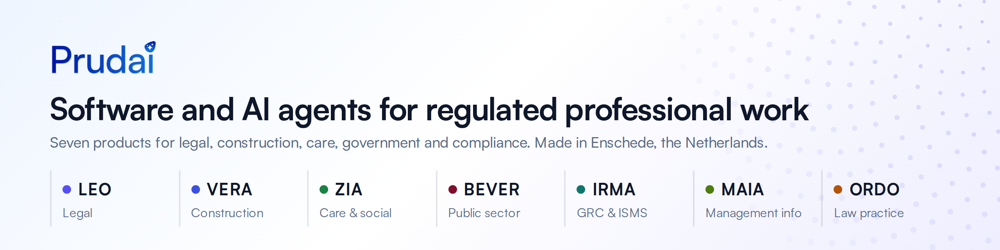
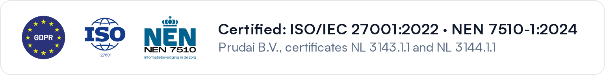

<picture>
  <source media="(prefers-color-scheme: dark)" srcset="assets/banner-dark.png">
  
</picture>

Prudai builds software and AI agents for professionals in the Netherlands whose work is bound by law, standards and professional rules: lawyers, construction quality assurers, care organisations, municipalities and compliance teams.

## Products

| Product | For | Link |
|---|---|---|
| **LEO** | Legal AI for law firms and in-house counsel | [leo.prudai.com](https://leo.prudai.com) |
| **VERA** | Construction: Bbl and Wkb compliance checks | [prudai.com/vera](https://prudai.com/vera) |
| **ZIA** | Care and the social domain | [prudai.com/zia](https://prudai.com/zia) |
| **BEVER** | Municipalities and public decision-making | [prudai.com/bever](https://prudai.com/bever) |
| **IRMA** | GRC and ISMS for ISO 27001, BIO2 and NEN 7510 | [prudai.com/irma](https://prudai.com/irma) |
| **MAIA** | Management information from all your data | [prudai.com/maia](https://prudai.com/maia) |
| **ORDO** | Practice management and document management for law firms | [prudai.com/ordo](https://prudai.com/ordo) |

Customers sign in at [app.prudai.com](https://app.prudai.com).

## How we work

- **Sources you can check.** LEO, VERA, ZIA, BEVER and IRMA work from one shared registry of more than 150 validated knowledge sources. The public ones are listed at [prudai.com/kennisbronnen](https://prudai.com/kennisbronnen).
- **Citations are checked, not trusted.** In LEO's chat, a server-side check confirms that every cited ruling (ECLI) was actually retrieved in the conversation. If it cannot be retrieved, the answer is marked as unverified.
- **People approve the plan.** A LEO workflow first proposes a plan; in most workflows LEO then waits for a person to approve, adjust or stop it before the specialist agents start.
- **Own infrastructure.** Customer data is stored on our own servers in EU data centres (Germany and Finland), not with a hyperscaler. AI inference runs through Google Cloud Vertex AI and Microsoft Azure OpenAI; chat requests use their EU endpoints. The providers do not use prompts or outputs to train models.
- **Certified.** Prudai is certified to ISO/IEC 27001:2022 and NEN 7510-1:2024 (Brand Compliance, RvA-accredited; certificates NL 3143.1.1 and NL 3144.1.1, valid until 29 September 2029).

<picture>
  <source media="(prefers-color-scheme: dark)" srcset="assets/certified-dark.png">
  
</picture>

## Public repositories

Most of our code is private. These building blocks are public:

| Repository | What it does | |
|---|---|---|
| [rechtspraak-mcp](https://github.com/Prudai/rechtspraak-mcp) | MCP server for Dutch case law: search and fetch rulings by ECLI via Rechtspraak Open Data and the LiDO citation graph. No API key. |   |
| [echr-extractor](https://github.com/Prudai/echr-extractor) | TypeScript library and CLI for ECHR case law from HUDOC: metadata, full text, citation networks and judgment sections. |   |
| [skeptic-audit](https://github.com/Prudai/skeptic-audit) | An independent second agent that audits a coding agent's change against an 8-point evidence checklist before you ship it. |  |
| [marketing-analytics](https://github.com/Prudai/marketing-analytics) | Shared analytics, cookie consent and error tracking for the Prudai websites, installed per site from a git tag. |  |

## Links

[Website](https://prudai.com) · [Docs](https://docs.prudai.com) · [Trust Center](https://trust.prudai.com) · [Legal](https://legal.prudai.com) · [Status](https://status.prudai.com) · [PrudentBench](https://prudai.com/prudentbench) · [Prudai Marketplace](https://github.com/Prudai-Marketplace)

## Security

Please report vulnerabilities to **[security@prudai.com](mailto:security@prudai.com)**, not in a public issue. See [SECURITY.md](https://github.com/Prudai/.github/blob/main/SECURITY.md) and our [security.txt](https://app.prudai.com/.well-known/security.txt).

## Company

Prudai B.V. · Enschede, the Netherlands · KvK 99876868 · [info@prudai.com](mailto:info@prudai.com) · Wikidata [Q139906958](https://www.wikidata.org/wiki/Q139906958)
